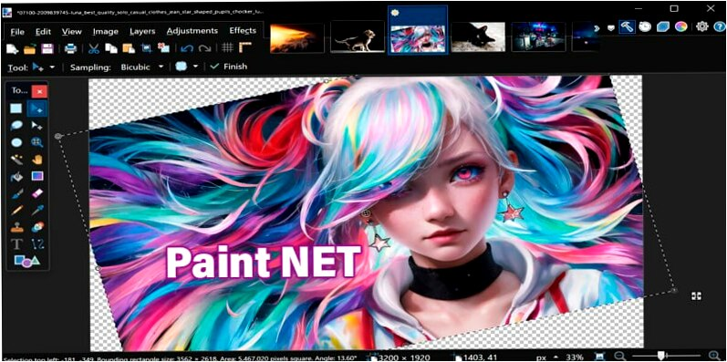

# The page for installing Paint.NET 
**Paint.NET** This image editing software for Windows offers layers, effects, and essential tools, making it suitable for both novice and experienced users. It’s intuitive, versatile, and perfect for tasks ranging from simple edits to complex designs. Plus, its capabilities can be enhanced even more with plugin support.

## To download Paint.NET from GitHub, simply follow these steps:

**1.** On this page, locate the Paint.NET installer and click to begin the installation process.

**2.** The download will commence and can be viewed in the top-right corner of your browser.

**3.** 3. Once the download finishes, open the file to proceed with the Paint.NET installation.
**4.** After installation, you're all set to start editing your images effortlessly!

### Why Choose Paint.NET

1. 💪**Powerful Tools** – Paint.NET offers robust image editing tools without any cost.
2. 🎨**User-Friendly ** – Its intuitive interface is perfect for both beginners and professionals.
3. 🖼️**Layer Support ** – Seamlessly handle multiple layers, great for complex design work.
4. ⚡**Fast & Efficient ** – Optimized for quick file processing, ensuring smooth and speedy performance.
5. 🔧**Customizable ** – Plugin support allows you to enhance and expand its functionality further.

